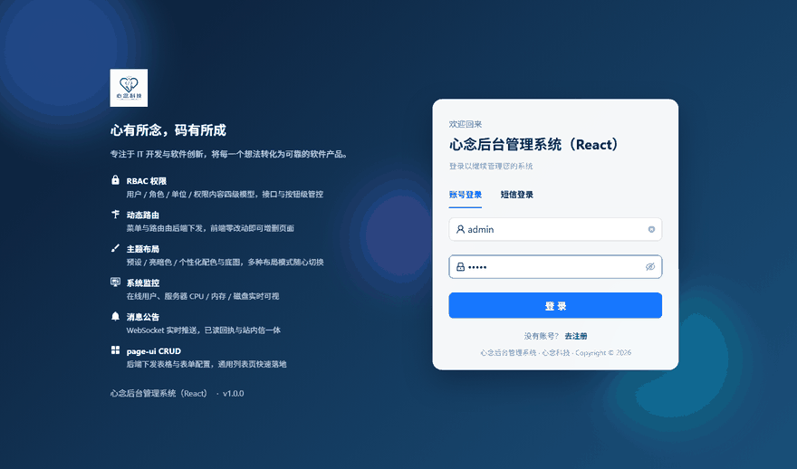
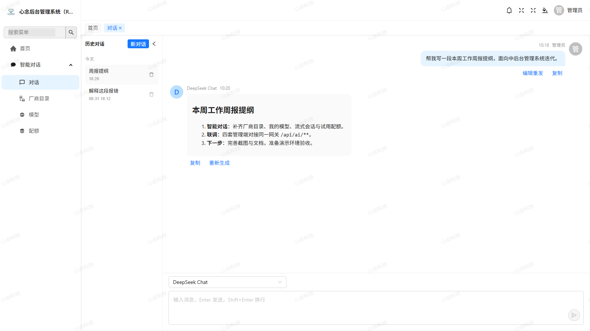
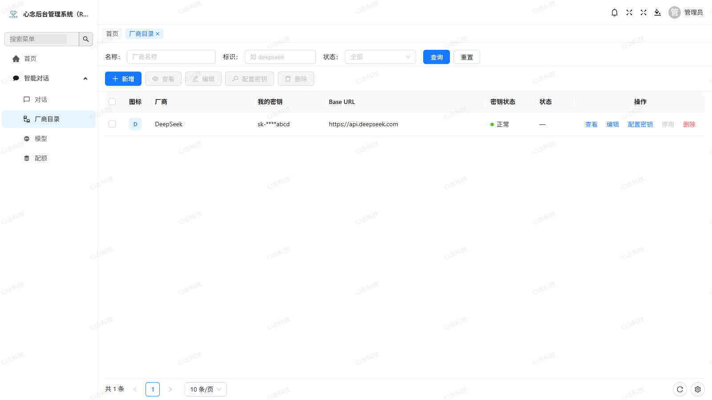
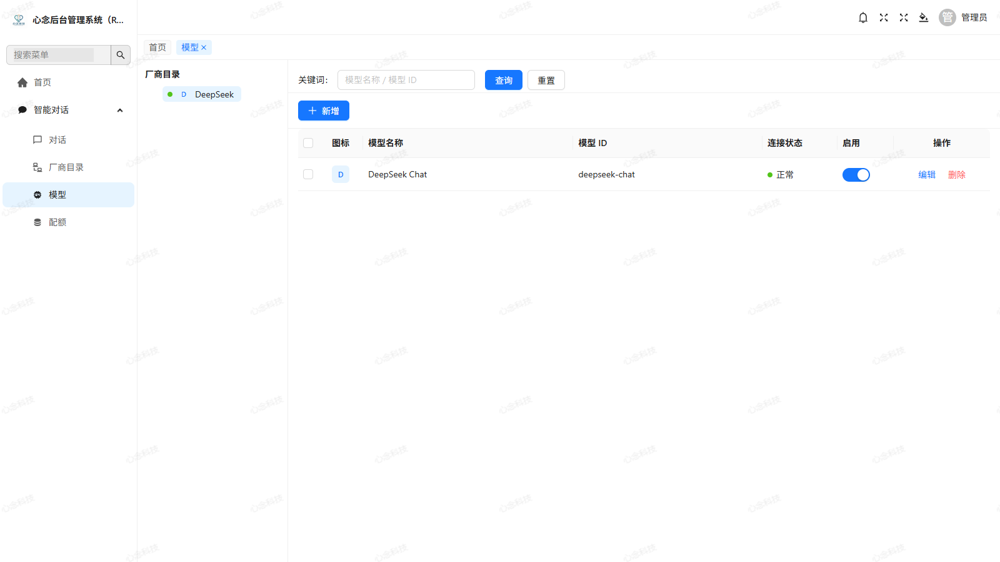
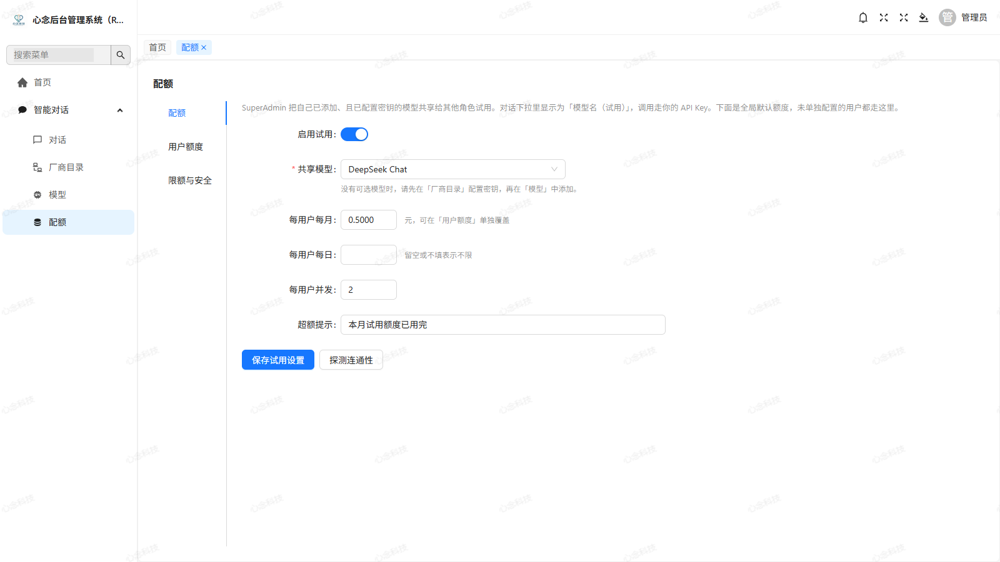
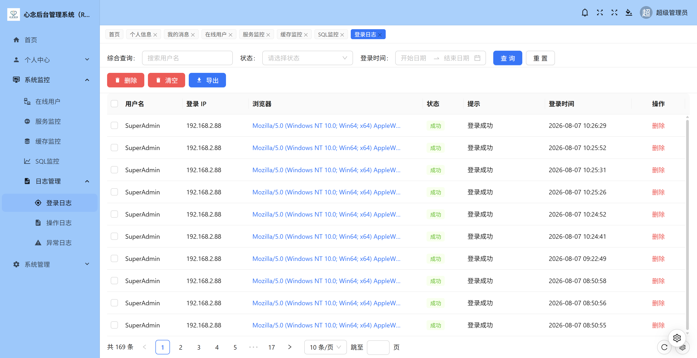
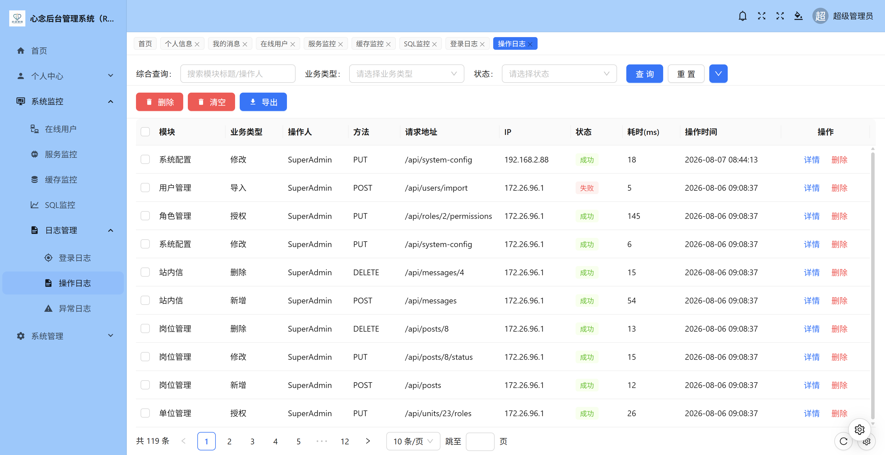
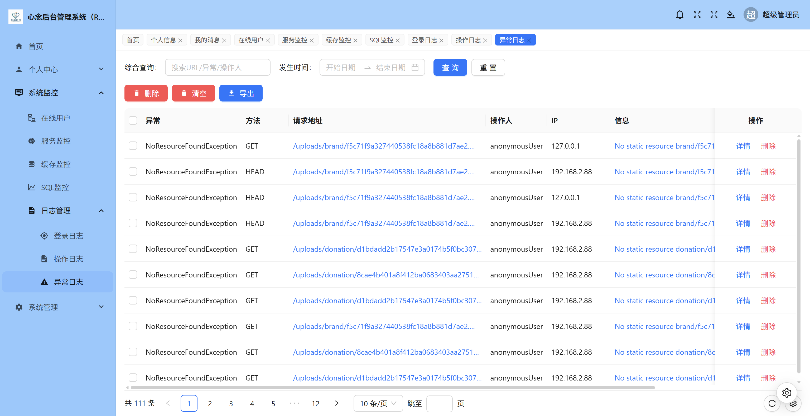
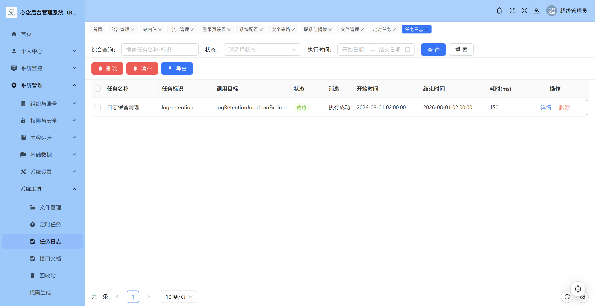

<p align="center">
  
</p>

# xn-admin-react-ts

[English](README.en.md) | [简体中文](README.md)

XinNian Admin frontend: React 19 + TypeScript + Vite + Ant Design.

Ported from the Vue baseline **xn-admin-vue3-ts**, talking to the same backend **xn-admin-cloud**. Business features match the Vue apps (auth, dynamic menus, RBAC, CRUD, layouts, AI chat, monitoring, files, jobs). Visuals use native Ant Design, not an Element look-alike. Apache License 2.0 — **free for personal and commercial use**.

[](./LICENSE)
[](./LICENSE)
[](./LICENSE)
[](./LICENSE)

Sync status: [`SYNC.md`](./SYNC.md).

Version: `1.1.0` · License: [Apache-2.0](./LICENSE) · Copyright 2026 XinNian

**Live demo:** https://react.xinniankeji.vip · Website: https://xinniankeji.vip

## Related repositories

| Repository          | Live                                    | Gitee                                                | GitHub                                                     | Notes                                 |
| ------------------- | --------------------------------------- | ---------------------------------------------------- | ---------------------------------------------------------- | ------------------------------------- |
| `xn-admin-cloud`    | [Site](https://xinniankeji.vip)         | [Gitee](https://gitee.com/jenning/xn-admin-cloud)    | [GitHub](https://github.com/xinnian0310/xn-admin-cloud)    | Backend (required)                    |
| `xn-admin-vue3-ts`  | [Demo](https://vue3-ts.xinniankeji.vip) | [Gitee](https://gitee.com/jenning/xn-admin-vue3-ts)  | [GitHub](https://github.com/xinnian0310/xn-admin-vue3-ts)  | Feature baseline (Vue 3 + TypeScript) |
| `xn-admin-vue3-js`  | [Demo](https://vue3-js.xinniankeji.vip) | [Gitee](https://gitee.com/jenning/xn-admin-vue3-js)  | [GitHub](https://github.com/xinnian0310/xn-admin-vue3-js)  | Vue 3 + JavaScript (Composition)      |
| `xn-admin-vue2-js`  | [Demo](https://vue2.xinniankeji.vip)    | [Gitee](https://gitee.com/jenning/xn-admin-vue2-js)  | [GitHub](https://github.com/xinnian0310/xn-admin-vue2-js)  | Vue 3 + JavaScript (Options API)      |
| `xn-admin-react-ts` | [Demo](https://react.xinniankeji.vip)   | [Gitee](https://gitee.com/jenning/xn-admin-react-ts) | [GitHub](https://github.com/xinnian0310/xn-admin-react-ts) | This repo                             |

## Prerequisites

1. Node.js 20+ (20 LTS recommended)
2. Backend **xn-admin-cloud** running, gateway at http://127.0.0.1:8088  
   (three-step start in that repo: `docker compose up -d` then `scripts/run-dev`)
3. Middleware can come from the backend Docker Compose (or your own MySQL / Redis / Nacos / MinIO)

## Default accounts

| Username     | Initial password | Notes       |
| ------------ | ---------------- | ----------- |
| `SuperAdmin` | `xinnian`        | Super admin |
| `admin`      | `admin`          | Admin       |

Local development only. Change passwords after login. See [SECURITY.md](./SECURITY.md).

## Quick start

```bash
npm install
npm run dev
```

Dev URL: http://localhost:1800

Vite proxies `/api`, `/uploads`, `/ws`, `/swagger-ui`, `/v3/api-docs` to `http://localhost:8088`.

```bash
npm run build         # tsc -b + vite
npm run preview
npm run typecheck
npm run lint
npm run lint:fix
npm run format
npm run ci            # typecheck + lint + format:check + build
```

## vs Vue baseline

| Item             | Vue (`xn-admin-vue3-ts`)        | This repo                              |
| ---------------- | ------------------------------- | -------------------------------------- |
| UI               | Element Plus                    | **Native Ant Design**                  |
| Primary / chrome | `#409eff` matching header/sider | `#1677ff` + light sider + white header |
| Menu icon field  | `icon` (Element)                | Prefer `iconAntd`, fall back to `icon` |
| State            | Pinia                           | Zustand                                |
| Router           | vue-router `addRoute`           | Dynamic `RouteObject`                  |
| Views            | `src/views`                     | `src/pages`                            |
| Permission       | `v-permission`                  | `<Auth>` / `usePermission`             |
| `APP_CLIENT_ID`  | `xn-admin-vue3-ts`              | `xn-admin-react-ts`                    |
| Dev port         | `1803`                          | `1800`                                 |

## Stack

React 19, TypeScript 6, Vite 8, Ant Design 6, Zustand 5, React Router 7, Axios, ECharts, wangEditor, ExcelJS, oxlint, Prettier, Husky.

## Layout

```
src/
├── api/
├── components/
├── config/
├── hooks/
├── layouts/
├── pages/
├── router/
├── stores/
├── styles/
├── types/
└── utils/
```

Typical list page: `XnPageLayout` → `XnSearch` → `XnButton` + `XnExport` → `XnTable` (+ optional `XnTreePanel`).

Full catalog (including `XnDialog` / `XnModal`, captcha, SMS, dict/org/region, image upload, watermark, Cron): [`src/components/README.md`](./src/components/README.md).

## Screenshots

Ant Design captures in [`docs/images/`](./docs/images/), same filenames as the Vue baseline.

### Login and dashboard

| Page      | Screenshot                                |
| --------- | ----------------------------------------- |
| Login     |          |
| Dashboard |  |

### AI chat

| Page      | Screenshot                                   |
| --------- | -------------------------------------------- |
| Chat      |         |
| Providers |  |
| Models    |        |
| Quota     |          |

### Profile

| Page        | Screenshot                                      |
| ----------- | ----------------------------------------------- |
| Profile     |            |
| My messages |  |

### Monitoring

| Page         | Screenshot                                        |
| ------------ | ------------------------------------------------- |
| Online users |  |
| Server       |        |
| Redis        |          |
| SQL          |              |

### Logs

| Page           | Screenshot                                          |
| -------------- | --------------------------------------------------- |
| Login logs     |          |
| Operation logs |       |
| Exception logs |  |
| Job logs       |              |

### Organization

| Page  | Screenshot                        |
| ----- | --------------------------------- |
| Users |  |
| Units |  |
| Posts |  |

### Permissions

| Page               | Screenshot                                                   |
| ------------------ | ------------------------------------------------------------ |
| Roles              |                             |
| Role permissions   |            |
| Permission catalog |  |
| Routes             |                           |

### Content and settings

| Page               | Screenshot                                               |
| ------------------ | -------------------------------------------------------- |
| Notices            |                     |
| Inbox              |                      |
| Dictionaries       |                  |
| Login page         |  |
| System config      |                |
| Security           |                   |
| Remote storage     |       |
| Contact & donation |                |

### Tools

| Page        | Screenshot                              |
| ----------- | --------------------------------------- |
| Files       |        |
| Jobs        |          |
| Recycle bin |    |
| Codegen     |    |
| API docs    |  |

## Production (summary)

- `npm run build`, then Nginx
- Reverse-proxy `/api`, `/uploads`, `/ws` to gateway `127.0.0.1:8088`
- [SECURITY.md](./SECURITY.md) · [CONTRIBUTING.md](./CONTRIBUTING.md)

## Support

If this project helps you, a coffee is welcome ☕

<p align="center">
  
</p>

## License

[Apache License 2.0](./LICENSE). Personal, commercial, closed-source, and redistribution are allowed if you keep copyright, license, and NOTICE, and mark modified files. Software is provided “as is”, without warranty.

Donations are voluntary and are not a commercial license or paid support.
